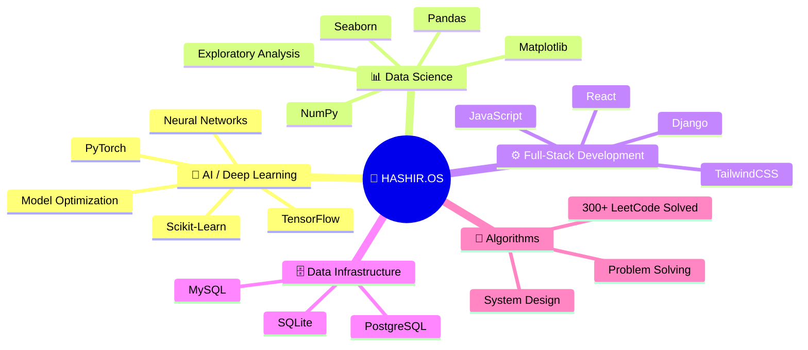

<!-- ═══════════════════════════════════════════════════════════════════════
     H A S H I R . O S
     THE NEURAL OPERATING SYSTEM — v3.8.0
     ═══════════════════════════════════════════════════════════════════════
     Engineer   : Malik Hashir Shakeel
     Institute  : NED University of Engineering & Technology, Karachi
     Core       : AI / Deep Learning / Full-Stack Engineering
     ═══════════════════════════════════════════════════════════════════════ -->

<!-- ╔═══════════════════════════════════════════════════╗ -->
<!-- ║         SECTION 01 : OS HUD HERO HEADER           ║ -->
<!-- ╚═══════════════════════════════════════════════════╝ -->

<div align="center">

```text
🔴 🟡 🟢 HASHIR.OS // TUI NEURAL TERMINAL v3.8.0 [OPERATIONAL]
╔═════════════════════════════════════════════════════════════════════════════╗
║                                                                             ║
║   ██╗  ██╗ █████╗ ███████╗██╗  ██╗██╗██████╗  ██████╗ ███████╗             ║
║   ██║  ██║██╔══██╗██╔════╝██║  ██║██║██╔══██╗██╔═══██╗██╔════╝             ║
║   ███████║███████║███████╗███████║██║██████╔╝██║   ██║███████╗             ║
║   ██╔══██║██╔══██║╚════██║██╔══██║██║██╔══██╗██║   ██║╚════██║             ║
║   ██║  ██║██║  ██║███████║██║  ██║██║██║  ██║╚██████╔╝███████║             ║
║   ╚═╝  ╚═╝╚═╝  ╚═╝╚══════╝╚═╝  ╚═╝╚═╝╚═╝  ╚═╝ ╚═════╝ ╚══════╝             ║
║                                                                             ║
║         ⚡ MALIK HASHIR SHAKEEL // AI & SYSTEM ARCHITECTURE CORE            ║
╚═════════════════════════════════════════════════════════════════════════════╝
```


<br>

<p align="center">
  
  &nbsp;
  
  &nbsp;
  <a href="https://malik-hashir-portfolio.vercel.app">
    
  </a>
  &nbsp;
  
</p>

</div>

<br>

<!-- ╔═══════════════════════════════════════════════════╗ -->
<!-- ║         SECTION 02 : SYSTEM DIRECTORY INDEX       ║ -->
<!-- ╚═══════════════════════════════════════════════════╝ -->

<div align="center">

```text
┌── SYSTEM MOUNT DIRECTORY ───────────────────────────────────────────────────┐
│                                                                             │
│   [01] /sys/info ........ System Specifications (Neofetch)                  │
│   [02] /sys/status ...... Kernel Interrupts & Status Logs                   │
│   [03] /sys/firmware .... Verified Deep Learning Certifications            │
│   [04] /proc/arch ....... Neural Architecture Mindmap                       │
│   [05] /bin/modules ..... Installed Tech Stack Libraries                    │
│   [06] /proc/projects ... Active Running Processes (Projects)               │
│   [07] /var/log/stats ... Real-time System Diagnostics & Telemetry          │
│   [08] /net/connect ..... Network Interfaces & Contact Ports                │
│                                                                             │
└─────────────────────────────────────────────────────────────────────────────┘
```

</div>

<br>

---

<!-- ╔═══════════════════════════════════════════════════╗ -->
<!-- ║         SECTION 03 : SYSTEM INFO (NEOFETCH)       ║ -->
<!-- ╚═══════════════════════════════════════════════════╝ -->

<div align="center">

## `> neofetch`

```text
╭──────────────────────────────────────────────────────────────────╮
│  🔴 🟡 🟢 HASHIR.OS // SYSTEM SPECS                               │
├──────────────────────────────────────────────────────────────────┤
│                                                                  │
│   Host ............. Malik Hashir Shakeel                        │
│   Kernel ........... AI Engineering Core                         │
│   OS ............... NED University of Eng. & Tech, Karachi      │
│   Uptime ........... 3+ years in system                          │
│   Shell ............ Python 3.x | JavaScript ES6+                │
│   Resolution ....... 300+ LeetCode problems resolved             │
│   CPU .............. Deep Learning Specialist [Certified]        │
│   GPU .............. TensorFlow + PyTorch Dual-Core              │
│   Memory ........... 5 Courses · 50+ Projects · ∞ Curiosity     │
│                                                                  │
│   [████████████████████░░░░░]  CGPA: 3.8 / 4.0                   │
│                                                                  │
╰──────────────────────────────────────────────────────────────────╯
```

</div>

<br>

<!-- ╔═══════════════════════════════════════════════════╗ -->
<!-- ║         SECTION 04 : CORE ALGORITHM               ║ -->
<!-- ╚═══════════════════════════════════════════════════╝ -->

<div align="center">

### `[ CORE_ALGORITHM_ENGINE ]`

$$\text{Attention}(Q, K, V) = \text{softmax}\left(\frac{QK^T}{\sqrt{d_k}}\right)V$$

<sub>⚡ Scaled Dot-Product Attention — The Mathematical Engine Driving Modern Transformer & AI Systems</sub>

</div>

<br>

---

<!-- ╔═══════════════════════════════════════════════════╗ -->
<!-- ║         SECTION 05 : SYSTEM STATUS                ║ -->
<!-- ╚═══════════════════════════════════════════════════╝ -->

<div align="center">

## `> systemctl status --all`

</div>

```diff
+ [ONLINE]   Neural Inference Core ........................ Active
+ [ONLINE]   Deep Learning Certification .................. Verified
+ [ONLINE]   Full-Stack Development Server ................ Running
+ [ONLINE]   Database Management Layer .................... Operational
+ [ACTIVE]   LeetCode Algorithm Engine .................... 300+ Resolved
+ [ACTIVE]   Research & Development Pipeline .............. In Progress
- [KILLED]   Generic Badge-Spam README .................... Terminated
```

> [!NOTE]
> **Kernel Interrupt Log:** `HASHIR.OS` is optimized for high-throughput Deep Learning model training, scalable full-stack backend development, and complex algorithmic problem solving.

<br>

---

<!-- ╔═══════════════════════════════════════════════════╗ -->
<!-- ║       SECTION 06 : FIRMWARE VERIFICATION          ║ -->
<!-- ╚═══════════════════════════════════════════════════╝ -->

<div align="center">

## `> verify --firmware --certificates`

```text
┌─── FIRMWARE VERIFICATION LOG ──────────────────────────────────────┐
│                                                                    │
│   ✅ VERIFIED   Deep Learning Specialization — Andrew Ng           │
│                 DeepLearning.AI × Coursera                         │
│                 5-Course Series | Neural Networks to Sequence       │
│                 Models, CNNs, Hyperparameter Tuning & More         │
│                                                                    │
│   🔑 Certificate Hash:                                             │
│      sha256:13acb02f8a3301a9678302b28c6944dd                      │
│                                                                    │
└────────────────────────────────────────────────────────────────────┘
```

<p align="center">
  <a href="https://coursera.org/share/13acb02f8a3301a9678302b28c6944dd">
    
  </a>
  &nbsp;
  <a href="https://www.deeplearning.ai/">
    
  </a>
</p>

</div>

<br>

---

<!-- ╔═══════════════════════════════════════════════════╗ -->
<!-- ║       SECTION 07 : NEURAL ARCHITECTURE            ║ -->
<!-- ╚═══════════════════════════════════════════════════╝ -->

<div align="center">

## `> cat /proc/architecture`

</div>



<br>

---

<!-- ╔═══════════════════════════════════════════════════╗ -->
<!-- ║       SECTION 08 : INSTALLED MODULES              ║ -->
<!-- ╚═══════════════════════════════════════════════════╝ -->

<div align="center">

## `> pkg list --installed`

<br>

```text
┌─────────────────────────────────────────────────────────────────────────────┐
│                       INSTALLED SYSTEM MODULES                              │
└─────────────────────────────────────────────────────────────────────────────┘
```

<h4><code>[ MODULE 01 : AI / ML ENGINE ]</code></h4>

<p align="center">
  <a href="https://skillicons.dev">
    
  </a>
</p>

<h4><code>[ MODULE 02 : DATA PIPELINE ]</code></h4>

<p align="center">
  
  
  
  
</p>

<h4><code>[ MODULE 03 : FRONTEND RUNTIME ]</code></h4>

<p align="center">
  <a href="https://skillicons.dev">
    
  </a>
</p>

<h4><code>[ MODULE 04 : BACKEND SERVER ]</code></h4>

<p align="center">
  <a href="https://skillicons.dev">
    
  </a>
</p>

<h4><code>[ MODULE 05 : DATABASE LAYER ]</code></h4>

<p align="center">
  <a href="https://skillicons.dev">
    
  </a>
</p>

<h4><code>[ MODULE 06 : DEVOPS & TOOLS ]</code></h4>

<p align="center">
  <a href="https://skillicons.dev">
    
  </a>
</p>

```text
┌─────────────────────────────────────────────────────────────────────────────┐
│                      ALL MODULES VERIFIED & LOADED                          │
└─────────────────────────────────────────────────────────────────────────────┘
```

</div>

<br>

---

<!-- ╔═══════════════════════════════════════════════════╗ -->
<!-- ║       SECTION 09 : PROCESS MONITOR                ║ -->
<!-- ╚═══════════════════════════════════════════════════╝ -->

<div align="center">

## `> htop --filter=projects`

```text
┌─── PROCESS MONITOR ─────────────────────────────────────────────────────────┐
```

| PID | Process | Status | Stack | Port |
|:---:|:--------|:------:|:------|:----:|
| `001` | **ClassConnect** — Virtual Classroom Platform | 🟢 `ACTIVE` | Django · MySQL | [→ OPEN](https://github.com/MalikHashirShakeel/ClassConnect) |
| `002` | **PayScript** — Invoice & Product Management | 🟢 `DEPLOYED` | Django · PostgreSQL | [→ OPEN](https://github.com/MalikHashirShakeel/PayScript) |
| `003` | **StackOverflow Analysis** — Developer Survey EDA | 🔵 `COMPLETE` | Pandas · Seaborn | [→ OPEN](https://github.com/MalikHashirShakeel/Data-Analysis-Case-Study) |
| `004` | **Insurance Predictor** — Medical Cost Regression | 🔵 `COMPLETE` | Scikit-Learn · Pandas | [→ OPEN](https://github.com/MalikHashirShakeel/Linear-Regression-Problem) |
| `005` | **Rain Predictor** — Weather Classification | 🔵 `COMPLETE` | Logistic Regression | [→ OPEN](https://github.com/MalikHashirShakeel/Logistic-Regression-Problem) |

```text
└─────────────────────────────────────────────────────────────────────────────┘
```

</div>

<br>

<div align="center">

<details>
<summary><b>📂 Inspect Process [PID 001] — ClassConnect</b></summary>
<br>

> **Google Classroom-inspired Virtual Classroom Platform**
>
> `FEATURES:`
> - ✅ Automated Quiz Checking
> - ✅ Discussion Forums
> - ✅ Assignment Management
> - ✅ Course Announcements
>
> `STACK:` Django · MySQL
>
> 🔗 [Access Repository](https://github.com/MalikHashirShakeel/ClassConnect)

</details>

<details>
<summary><b>📂 Inspect Process [PID 002] — PayScript</b></summary>
<br>

> **Professional Invoice Generation & Product Management System**
>
> Built for a **real client** — production deployed.
>
> `STACK:` Django · PostgreSQL
>
> 🔗 [Access Repository](https://github.com/MalikHashirShakeel/PayScript)

</details>

<details>
<summary><b>📂 Inspect Process [PID 003] — StackOverflow Analysis</b></summary>
<br>

> **Exploratory Data Analysis on StackOverflow Developer Survey**
>
> Comprehensive statistical analysis and visualization of developer trends.
>
> `STACK:` Pandas · Matplotlib · Seaborn
>
> 🔗 [Access Repository](https://github.com/MalikHashirShakeel/Data-Analysis-Case-Study)

</details>

<details>
<summary><b>📂 Inspect Process [PID 004] — Insurance Predictor</b></summary>
<br>

> **Medical Insurance Charges Prediction using Linear Regression**
>
> End-to-end ML pipeline: data preprocessing, feature engineering, model training & evaluation.
>
> `STACK:` Scikit-Learn · Pandas
>
> 🔗 [Access Repository](https://github.com/MalikHashirShakeel/Linear-Regression-Problem)

</details>

<details>
<summary><b>📂 Inspect Process [PID 005] — Rain Predictor</b></summary>
<br>

> **Weather Prediction using Logistic Regression**
>
> Binary classification model trained on Australian weather dataset.
>
> `STACK:` Logistic Regression · Pandas
>
> 🔗 [Access Repository](https://github.com/MalikHashirShakeel/Logistic-Regression-Problem)

</details>

</div>

<br>

---

<!-- ╔═══════════════════════════════════════════════════╗ -->
<!-- ║       SECTION 10 : SYSTEM DIAGNOSTICS             ║ -->
<!-- ╚═══════════════════════════════════════════════════╝ -->

<div align="center">

## `> diagnostics --full`

```text
┌─── REAL-TIME SYSTEM DIAGNOSTICS & TELEMETRY ────────────────────────────────┐
```

<br>

<p align="center">
  
  &nbsp;&nbsp;&nbsp;
  
</p>

<br>

<p align="center">
  
</p>

<br>

<p align="center">
  
</p>

<br>

<p align="center">
  
</p>

<p align="center">
  
  &nbsp;&nbsp;
  
</p>

```text
└─────────────────────────────────────────────────────────────────────────────┘
```

</div>

<br>

---

<!-- ╔═══════════════════════════════════════════════════╗ -->
<!-- ║       SECTION 11 : ACHIEVEMENT LOG                ║ -->
<!-- ╚═══════════════════════════════════════════════════╝ -->

<div align="center">

## `> cat /var/log/achievements`

<p align="center">
  
</p>

</div>

<br>

---

<!-- ╔═══════════════════════════════════════════════════╗ -->
<!-- ║     SECTION 12 : NEURAL ACTIVITY VISUALIZATION    ║ -->
<!-- ╚═══════════════════════════════════════════════════╝ -->

<div align="center">

## `> trace --neural-pathways`

<p align="center">
  <picture>
    <source media="(prefers-color-scheme: dark)" srcset="https://raw.githubusercontent.com/MalikHashirShakeel/MalikHashirShakeel/output/github-snake-dark.svg"/>
    <source media="(prefers-color-scheme: light)" srcset="https://raw.githubusercontent.com/MalikHashirShakeel/MalikHashirShakeel/output/github-snake-dark.svg"/>
    
  </picture>
</p>

</div>

<br>

---

<!-- ╔═══════════════════════════════════════════════════╗ -->
<!-- ║       SECTION 13 : BENCHMARK RESULTS              ║ -->
<!-- ╚═══════════════════════════════════════════════════╝ -->

<div align="center">

## `> benchmark --algorithms`

```text
┌─── ALGORITHM BENCHMARK RESULTS ─────────────────────────────────────────────┐
│                                                                             │
│   Engine    : LeetCode Algorithmic Processing Unit                          │
│   Resolved  : 300+ Problems                                                 │
│   Domains   : Arrays · Trees · Graphs · Dynamic Programming · Strings       │
│   Status    : Active Execution                                              │
│                                                                             │
└─────────────────────────────────────────────────────────────────────────────┘
```

<p align="center">
  <a href="https://leetcode.com/u/Malik_Hashir/">
    
  </a>
</p>

</div>

<br>

---

<!-- ╔═══════════════════════════════════════════════════╗ -->
<!-- ║       SECTION 14 : NETWORK INTERFACES             ║ -->
<!-- ╚═══════════════════════════════════════════════════╝ -->

<div align="center">

## `> ifconfig --all`

```text
┌─── ACTIVE NETWORK INTERFACES ───────────────────────────────────────────────┐
│                                                                             │
│   eth0   Portfolio ........... █████████████████████████  UP  ✓              │
│   eth1   GitHub .............. █████████████████████████  UP  ✓              │
│   eth2   LinkedIn ............ █████████████████████████  UP  ✓              │
│   eth3   Gmail ............... █████████████████████████  UP  ✓              │
│                                                                             │
│   Status: All interface ports open and ready for connections.               │
│                                                                             │
└─────────────────────────────────────────────────────────────────────────────┘
```

<p align="center">
  <a href="https://malik-hashir-portfolio.vercel.app">
    
  </a>
  &nbsp;
  <a href="https://github.com/MalikHashirShakeel">
    
  </a>
  &nbsp;
  <a href="https://www.linkedin.com/in/malik-hashir-53a15a294/">
    
  </a>
  &nbsp;
  <a href="mailto:malik2244h@gmail.com">
    
  </a>
</p>

</div>

<br>

---

<!-- ╔═══════════════════════════════════════════════════╗ -->
<!-- ║         SECTION 15 : TUI SYSTEM FOOTER            ║ -->
<!-- ╚═══════════════════════════════════════════════════╝ -->

<br>

<div align="center">

```text
🔴 🟡 🟢 HASHIR.OS // SYSTEM SHUTDOWN SEQUENCE [STANDBY MODE]
╔═════════════════════════════════════════════════════════════════════════════╗
║                                                                             ║
║       "Transforming Data into Intelligence. Algorithms into Impact."        ║
║                                                                             ║
║       ── Malik Hashir Shakeel // AI Engineer & System Builder               ║
║                                                                             ║
║   [HASHIR.OS] Uptime: ∞  │  Status: ALWAYS LEARNING  │  Kernel: AI CORE     ║
║                                                                             ║
╚═════════════════════════════════════════════════════════════════════════════╝
```

<br>

<p align="center">
  
  &nbsp;
  
  &nbsp;
  
</p>

</div>

<br>

<!-- ═══════════════════════════════════════════════════════════════════════
     END OF HASHIR.OS — THE NEURAL OPERATING SYSTEM
     Built with precision. Engineered with purpose.
     ═══════════════════════════════════════════════════════════════════════ -->
