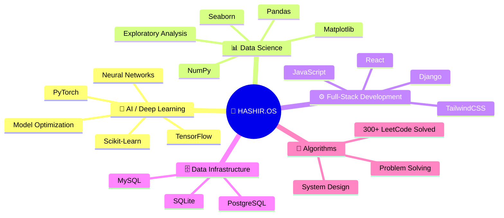

<!-- ═══════════════════════════════════════════════════════════════════════
     H A S H I R . O S
     THE NEURAL OPERATING SYSTEM — v3.8.0
     ═══════════════════════════════════════════════════════════════════════
     Engineer   : Malik Hashir Shakeel
     Institute  : NED University of Engineering & Technology, Karachi
     Core       : AI / Deep Learning / Full-Stack Engineering
     ═══════════════════════════════════════════════════════════════════════ -->

<!-- ╔═══════════════════════════════════════════════════╗ -->
<!-- ║           SECTION 01 : BOOT SEQUENCE              ║ -->
<!-- ╚═══════════════════════════════════════════════════╝ -->

<p align="center">
  
</p>

<p align="center">
  
</p>

<p align="center">
  
  &nbsp;&nbsp;
  <a href="https://malik-hashir-portfolio.vercel.app">
    
  </a>
</p>

<br>

<!-- ╔═══════════════════════════════════════════════════╗ -->
<!-- ║         SECTION 02 : SYSTEM INFO (NEOFETCH)       ║ -->
<!-- ╚═══════════════════════════════════════════════════╝ -->

## `> neofetch`

```
╭──────────────────────────────────────────────────────────────────╮
│                                                                  │
│   HASHIR.OS v3.8.0                                               │
│   ════════════════                                               │
│                                                                  │
│   Host ............. Malik Hashir Shakeel                        │
│   Kernel ........... AI Engineering Core                         │
│   OS ............... NED University of Eng. & Tech, Karachi      │
│   Uptime ........... 3+ years in system                          │
│   Shell ............ Python 3.x | JavaScript ES6+                │
│   Resolution ....... 300+ LeetCode problems resolved             │
│   CPU .............. Deep Learning Specialist [Certified]        │
│   GPU .............. TensorFlow + PyTorch Dual-Core              │
│   Memory ........... 5 Courses · 50+ Projects · ∞ Curiosity     │
│                                                                  │
│   ████████████████████░░░░░  CGPA: 3.8 / 4.0                    │
│                                                                  │
╰──────────────────────────────────────────────────────────────────╯
```

<br>

<!-- ╔═══════════════════════════════════════════════════╗ -->
<!-- ║         SECTION 03 : CORE ALGORITHM               ║ -->
<!-- ╚═══════════════════════════════════════════════════╝ -->

<div align="center">

### `[ CORE_ALGORITHM ]`

$$\text{Attention}(Q, K, V) = \text{softmax}\left(\frac{QK^T}{\sqrt{d_k}}\right)V$$

<sub>⚡ Scaled Dot-Product Attention — The Engine Behind Modern AI</sub>

</div>

<br>

---

<!-- ╔═══════════════════════════════════════════════════╗ -->
<!-- ║         SECTION 04 : SYSTEM STATUS                ║ -->
<!-- ╚═══════════════════════════════════════════════════╝ -->

## `> systemctl status --all`

```diff
+ [ONLINE]   Neural Inference Core ........................ Active
+ [ONLINE]   Deep Learning Certification .................. Verified
+ [ONLINE]   Full-Stack Development Server ................ Running
+ [ONLINE]   Database Management Layer .................... Operational
+ [ACTIVE]   LeetCode Algorithm Engine .................... 300+ Resolved
+ [ACTIVE]   Research & Development Pipeline .............. In Progress
- [KILLED]   Generic Badge-Spam README .................... Terminated
```

<br>

---

<!-- ╔═══════════════════════════════════════════════════╗ -->
<!-- ║       SECTION 05 : FIRMWARE VERIFICATION          ║ -->
<!-- ╚═══════════════════════════════════════════════════╝ -->

## `> verify --firmware --certificates`

```
┌─── FIRMWARE VERIFICATION LOG ──────────────────────────────────────┐
│                                                                    │
│   ✅ VERIFIED   Deep Learning Specialization — Andrew Ng           │
│                 DeepLearning.AI × Coursera                         │
│                 5-Course Series | Neural Networks to Sequence       │
│                 Models, CNNs, Hyperparameter Tuning & More         │
│                                                                    │
│   🔑 Certificate Hash:                                             │
│      sha256:13acb02f8a3301a9678302b28c6944dd                      │
│                                                                    │
└────────────────────────────────────────────────────────────────────┘
```

<p align="center">
  <a href="https://coursera.org/share/13acb02f8a3301a9678302b28c6944dd">
    
  </a>
  &nbsp;
  <a href="https://www.deeplearning.ai/">
    
  </a>
</p>

<br>

---

<!-- ╔═══════════════════════════════════════════════════╗ -->
<!-- ║       SECTION 06 : NEURAL ARCHITECTURE            ║ -->
<!-- ╚═══════════════════════════════════════════════════╝ -->

## `> cat /proc/architecture`



<br>

---

<!-- ╔═══════════════════════════════════════════════════╗ -->
<!-- ║       SECTION 07 : INSTALLED MODULES              ║ -->
<!-- ╚═══════════════════════════════════════════════════╝ -->

## `> pkg list --installed`

```
┌─── CORE MODULES ──────────────────────────────────────────────────┐
```

<h4 align="center"><code>AI / ML Engine</code></h4>

<p align="center">
  <a href="https://skillicons.dev">
    
  </a>
</p>

<h4 align="center"><code>Data Pipeline</code></h4>

<p align="center">
  
  
  
  
</p>

<h4 align="center"><code>Frontend Runtime</code></h4>

<p align="center">
  <a href="https://skillicons.dev">
    
  </a>
</p>

<h4 align="center"><code>Backend Server</code></h4>

<p align="center">
  <a href="https://skillicons.dev">
    
  </a>
</p>

<h4 align="center"><code>Database Layer</code></h4>

<p align="center">
  <a href="https://skillicons.dev">
    
  </a>
</p>

<h4 align="center"><code>DevOps & Tools</code></h4>

<p align="center">
  <a href="https://skillicons.dev">
    
  </a>
</p>

```
└────────────────────────────────────────────────────────────────────┘
```

<br>

---

<!-- ╔═══════════════════════════════════════════════════╗ -->
<!-- ║       SECTION 08 : PROCESS MONITOR                ║ -->
<!-- ╚═══════════════════════════════════════════════════╝ -->

## `> htop --filter=projects`

```
┌─── PROCESS MONITOR ───────────────────────────────────────────────┐
```

| PID | Process | Status | Stack | Port |
|:---:|:--------|:------:|:------|:----:|
| `001` | **ClassConnect** — Virtual Classroom Platform | 🟢 `ACTIVE` | Django · MySQL | [→ OPEN](https://github.com/MalikHashirShakeel/ClassConnect) |
| `002` | **PayScript** — Invoice & Product Management | 🟢 `DEPLOYED` | Django · PostgreSQL | [→ OPEN](https://github.com/MalikHashirShakeel/PayScript) |
| `003` | **StackOverflow Analysis** — Developer Survey EDA | 🔵 `COMPLETE` | Pandas · Seaborn | [→ OPEN](https://github.com/MalikHashirShakeel/Data-Analysis-Case-Study) |
| `004` | **Insurance Predictor** — Medical Cost Regression | 🔵 `COMPLETE` | Scikit-Learn · Pandas | [→ OPEN](https://github.com/MalikHashirShakeel/Linear-Regression-Problem) |
| `005` | **Rain Predictor** — Weather Classification | 🔵 `COMPLETE` | Logistic Regression | [→ OPEN](https://github.com/MalikHashirShakeel/Logistic-Regression-Problem) |

```
└────────────────────────────────────────────────────────────────────┘
```

<br>

<details>
<summary><b>📂 Inspect Process [PID 001] — ClassConnect</b></summary>
<br>

> **Google Classroom-inspired Virtual Classroom Platform**
>
> `FEATURES:`
> - ✅ Automated Quiz Checking
> - ✅ Discussion Forums
> - ✅ Assignment Management
> - ✅ Course Announcements
>
> `STACK:` Django · MySQL
>
> 🔗 [Access Repository](https://github.com/MalikHashirShakeel/ClassConnect)

</details>

<details>
<summary><b>📂 Inspect Process [PID 002] — PayScript</b></summary>
<br>

> **Professional Invoice Generation & Product Management System**
>
> Built for a **real client** — production deployed.
>
> `STACK:` Django · PostgreSQL
>
> 🔗 [Access Repository](https://github.com/MalikHashirShakeel/PayScript)

</details>

<details>
<summary><b>📂 Inspect Process [PID 003] — StackOverflow Analysis</b></summary>
<br>

> **Exploratory Data Analysis on StackOverflow Developer Survey**
>
> Comprehensive statistical analysis and visualization of developer trends.
>
> `STACK:` Pandas · Matplotlib · Seaborn
>
> 🔗 [Access Repository](https://github.com/MalikHashirShakeel/Data-Analysis-Case-Study)

</details>

<details>
<summary><b>📂 Inspect Process [PID 004] — Insurance Predictor</b></summary>
<br>

> **Medical Insurance Charges Prediction using Linear Regression**
>
> End-to-end ML pipeline: data preprocessing, feature engineering, model training & evaluation.
>
> `STACK:` Scikit-Learn · Pandas
>
> 🔗 [Access Repository](https://github.com/MalikHashirShakeel/Linear-Regression-Problem)

</details>

<details>
<summary><b>📂 Inspect Process [PID 005] — Rain Predictor</b></summary>
<br>

> **Weather Prediction using Logistic Regression**
>
> Binary classification model trained on Australian weather dataset.
>
> `STACK:` Logistic Regression · Pandas
>
> 🔗 [Access Repository](https://github.com/MalikHashirShakeel/Logistic-Regression-Problem)

</details>

<br>

---

<!-- ╔═══════════════════════════════════════════════════╗ -->
<!-- ║       SECTION 09 : SYSTEM DIAGNOSTICS             ║ -->
<!-- ╚═══════════════════════════════════════════════════╝ -->

## `> diagnostics --full`

```
┌─── SYSTEM DIAGNOSTICS ────────────────────────────────────────────┐
```

<br>

<p align="center">
  
  &nbsp;&nbsp;&nbsp;
  
</p>

<br>

<p align="center">
  
</p>

<br>

<p align="center">
  
</p>

<br>

<p align="center">
  
</p>

<p align="center">
  
  &nbsp;&nbsp;
  
</p>

```
└────────────────────────────────────────────────────────────────────┘
```

<br>

---

<!-- ╔═══════════════════════════════════════════════════╗ -->
<!-- ║       SECTION 10 : ACHIEVEMENT LOG                ║ -->
<!-- ╚═══════════════════════════════════════════════════╝ -->

## `> cat /var/log/achievements`

<p align="center">
  
</p>

<br>

---

<!-- ╔═══════════════════════════════════════════════════╗ -->
<!-- ║     SECTION 11 : NEURAL ACTIVITY VISUALIZATION    ║ -->
<!-- ╚═══════════════════════════════════════════════════╝ -->

## `> trace --neural-pathways`

<p align="center">
  <picture>
    <source media="(prefers-color-scheme: dark)" srcset="https://raw.githubusercontent.com/MalikHashirShakeel/MalikHashirShakeel/output/github-snake-dark.svg"/>
    <source media="(prefers-color-scheme: light)" srcset="https://raw.githubusercontent.com/MalikHashirShakeel/MalikHashirShakeel/output/github-snake-dark.svg"/>
    
  </picture>
</p>

<br>

---

<!-- ╔═══════════════════════════════════════════════════╗ -->
<!-- ║       SECTION 12 : BENCHMARK RESULTS              ║ -->
<!-- ╚═══════════════════════════════════════════════════╝ -->

## `> benchmark --algorithms`

```
┌─── ALGORITHM BENCHMARK RESULTS ───────────────────────────────────┐
│                                                                    │
│   Engine    : LeetCode Algorithm Processing Unit                   │
│   Resolved  : 300+ problems                                       │
│   Domains   : Arrays · Trees · Graphs · DP · Strings · More       │
│   Status    : Actively solving                                     │
│                                                                    │
└────────────────────────────────────────────────────────────────────┘
```

<p align="center">
  <a href="https://leetcode.com/u/Malik_Hashir/">
    
  </a>
</p>

<br>

---

<!-- ╔═══════════════════════════════════════════════════╗ -->
<!-- ║       SECTION 13 : NETWORK INTERFACES             ║ -->
<!-- ╚═══════════════════════════════════════════════════╝ -->

## `> ifconfig`

```
┌─── ACTIVE NETWORK INTERFACES ─────────────────────────────────────┐
│                                                                    │
│   eth0   Portfolio ........... ██████████████  UP  ✓               │
│   eth1   GitHub .............. ██████████████  UP  ✓               │
│   eth2   LinkedIn ............ ██████████████  UP  ✓               │
│   eth3   Gmail ............... ██████████████  UP  ✓               │
│                                                                    │
│   All interfaces operational. Accepting connections.               │
│                                                                    │
└────────────────────────────────────────────────────────────────────┘
```

<p align="center">
  <a href="https://malik-hashir-portfolio.vercel.app">
    
  </a>
  &nbsp;
  <a href="https://github.com/MalikHashirShakeel">
    
  </a>
  &nbsp;
  <a href="https://www.linkedin.com/in/malik-hashir-53a15a294/">
    
  </a>
  &nbsp;
  <a href="mailto:malik2244h@gmail.com">
    
  </a>
</p>

<br>

---

<!-- ╔═══════════════════════════════════════════════════╗ -->
<!-- ║           SECTION 14 : SYSTEM FOOTER              ║ -->
<!-- ╚═══════════════════════════════════════════════════╝ -->

<br>

<div align="center">

```
╭──────────────────────────────────────────────────────────────╮
│                                                              │
│   "Transforming Data into Intelligence.                      │
│    Algorithms into Impact."                                  │
│                                                              │
│   ── Malik Hashir Shakeel                                    │
│                                                              │
╰──────────────────────────────────────────────────────────────╯
```

<br>

`[HASHIR.OS]` System uptime: `∞` · Status: `Always Learning` · Kernel: `AI Engineering`

</div>

<br>

<p align="center">
  
</p>

<!-- ═══════════════════════════════════════════════════════════════════════
     END OF HASHIR.OS — THE NEURAL OPERATING SYSTEM
     Built with precision. Engineered with purpose.
     ═══════════════════════════════════════════════════════════════════════ -->
